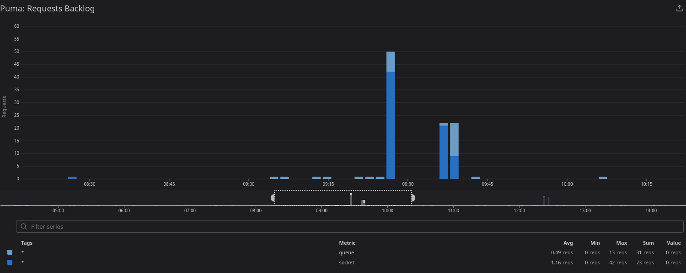

## Keeping track of waiting requests

There are requests waiting in 2 places:
- socket
- queue

Their sum is a total number of accepted requests waiting.

Puma configuration

```ruby
plugin :telemetry

Puma::Plugin::Telemetry.configure do |config|
  config.enabled = true
  config.initial_delay = 10

  config.puma_telemetry = %w[queue.backlog]

  config.socket_telemetry!

  config.add_target :dogstatsd, client: Datadog::Statsd.new(tags: %w[your tags], namespace: "ruby.puma")
end
```

Example Datadog widget and it's configuration. Depending on what you prefer to see, you might replace `rollup(max)` with `rollup(sum)` whenever you want to see maximum value or sum across the aggregated time frame.

| :point_up:    | Remember to update tags after initial setup! |
|---------------|:---------------------------------------------|



```json
{
    "viz": "timeseries",
    "requests": [
        {
            "style": {
                "palette": "dog_classic",
                "type": "solid",
                "width": "normal"
            },
            "type": "bars",
            "formulas": [
                {
                    "alias": "queue",
                    "formula": "query1"
                },
                {
                    "alias": "socket",
                    "formula": "query2"
                }
            ],
            "response_format": "timeseries",
            "on_right_yaxis": false,
            "queries": [
                {
                    "query": "max:ruby.puma.queue.backlog{}.rollup(max)",
                    "data_source": "metrics",
                    "name": "query1"
                },
                {
                    "query": "max:ruby.puma.sockets.backlog{}.rollup(max)",
                    "data_source": "metrics",
                    "name": "query2"
                }
            ]
        }
    ],
    "yaxis": {
        "include_zero": true,
        "max": "auto",
        "scale": "linear",
        "min": "auto",
        "label": ""
    },
    "markers": []
}
```

## Keeping track of request queue time

The time request spent waiting to be processed, between it's accepted by Load Balancer till it starts going through Rack Middleware in your application. Holy grail of autoscaling.

Example configuration of middleware, i.e. in case of Rails it could be placed under `config/initializers/request_queue_time.rb`

```ruby
Rails.application.config.middleware.insert_after(
  0,
  RequestQueueTimeMiddleware,
  statsd: Datadog::Statsd.new(namespace: "ruby.puma", tags: %w[your tags])
)
```

If you are utilizing tags in your logs, you might also want to add this measurement as follows:

```ruby
Rails.application.config.log_tags ||= {}
Rails.application.config.log_tags[:queue_time] = ->(req) { req.env[::RequestQueueTimeMiddleware::ENV_KEY] }
```

Example Datadog widget with configuration.

| :point_up:    | Remember to update tags after initial setup! |
|---------------|:---------------------------------------------|


```json
{
    "viz": "timeseries",
    "requests": [
        {
            "style": {
                "palette": "dog_classic",
                "type": "solid",
                "width": "normal"
            },
            "type": "line",
            "response_format": "timeseries",
            "queries": [
                {
                    "query": "max:ruby.puma.queue.time.max{}",
                    "data_source": "metrics",
                    "name": "query1"
                },
                {
                    "query": "max:ruby.puma.queue.time.95percentile{}",
                    "data_source": "metrics",
                    "name": "query2"
                },
                {
                    "query": "max:ruby.puma.queue.time.median{}",
                    "data_source": "metrics",
                    "name": "query3"
                }
            ],
            "formulas": [
                {
                    "alias": "max",
                    "formula": "query1"
                },
                {
                    "alias": "p95",
                    "formula": "query2"
                },
                {
                    "alias": "median",
                    "formula": "query3"
                }
            ]
        }
    ],
    "yaxis": {
        "include_zero": true,
        "max": "auto",
        "scale": "linear",
        "min": "auto",
        "label": ""
    },
    "markers": []
}
```
